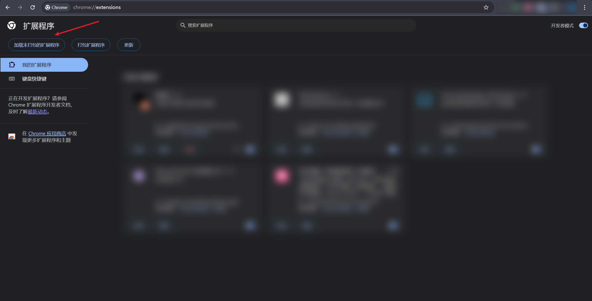

<h1 align="center">反调试破除者--AntiDebug_Breaker</h1>

## Intro

本插件是基于<a href="https://github.com/0xsdeo/Hook_JS">Hook_JS库</a>所写的google插件，将致力于绕过前端各种反调试操作。

## 插件安装

将源码下载到本地后打开chrome，访问`chrome://extensions/`，点击左上角的`加载未打包的扩展程序`，然后选中源码文件夹即可：


## 脚本使用场景

- Bypass Debugger

该脚本用于绕过**无限Debugger**，目前引起无限Debugger的三种核心方式为：

> eval

> Function

> Function.prototype.constructor

本脚本通过 Hook 以上核心函数有效绕过大部分前端无限 debugger。但因 eval 作用域问题，某些网站可能会报错。此时可切换至火狐浏览器无视debugger进行调试。

注：极少数网站可能采用特殊反制措施（如故意引发eval作用域问题或其他问题），导致前端报错或依然能引起debugger，这种情况需针对性解决。总体而言，**本脚本能覆盖绝大多数场景**。

脚本原理：<a href="https://mp.weixin.qq.com/s/3xagT-PXCgGrw9YiaCe__g">JS逆向系列14-Bypass Debugger</a>

- hook_log v0.1

该脚本用于防止js重写log方法，如本脚本不生效可切换至v0.2脚本。

脚本原理：<a href="https://mp.weixin.qq.com/s/l6_m3x3TbKDma_eexxx-Zw">JS逆向系列13-反调试之console.log</a>

- hook_log v0.2

本脚本功能同上，如这两个脚本均防止不了js重写log方法，可联系我本人。

注：**这两个脚本不能混用。**

- Hook table

绕过js检测运行时间差来实现反调试。

本脚本将针对以下这三种特征的反调试网站(注：包括但不仅限于这以下三种特征，需根据实际情况去判断是否需要使用本脚本)：

> 频繁调用console.clear清除控制台数据

> 控制台频繁输出大量内容

> 进行完以上两种操作后直接使用location.href进行跳转，一般跳转到主域名为github.io的网站。

如存在以上特征的网站，均可尝试使用本脚本去进行绕过。

脚本原理：<a href="https://mp.weixin.qq.com/s/JZu-fknVdEpaI5anzSlLjg">JS逆向系列19-无感绕过一类运行时间差反调试</a>

- hook clear

禁止js清除控制台数据。

脚本原理：<a href="https://mp.weixin.qq.com/s/r-ZcP2knpmoVEK0y_26xBw">JS逆向系列10-反调试与反反调试</a>

- hook close

重写close，以此来避免网站反调试关闭当前页面。

脚本原理：<a href="https://mp.weixin.qq.com/s/r-ZcP2knpmoVEK0y_26xBw">JS逆向系列10-反调试与反反调试</a>

- hook history

避免网站反调试返回上一页或某个特定历史页面。

脚本原理：<a href="https://mp.weixin.qq.com/s/r-ZcP2knpmoVEK0y_26xBw">JS逆向系列10-反调试与反反调试</a>

- Fixed window size

固定浏览器高度宽度值以绕过前端检测用户是否打开控制台。

固定的宽度高度值：
```text
innerHeight：660
innerWidth：1366

outerHeight：760
outerWidth：1400
```

- 页面跳转JS代码定位通杀方案

本脚本为CC11001100师傅所作，脚本原地址：`https://github.com/JSREI/page-redirect-code-location-hook`，用于阻断页面跳转，留在当前页面分析。

## 插件使用注意事项

进入网页后，无论是开启脚本还是关闭脚本，需刷新页面后才会生效。

## 致谢

CC11001100、Dexter
